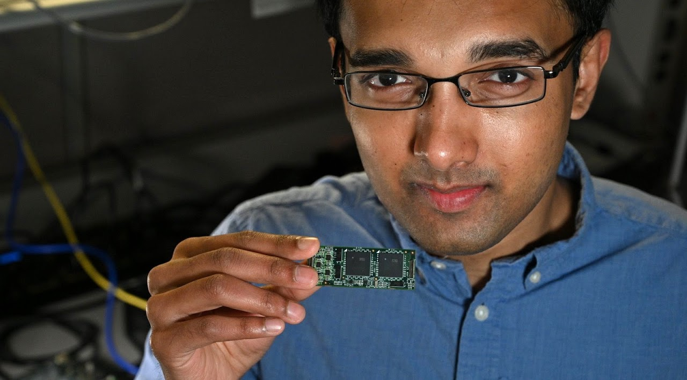

## Nabil Imam 

Contact: ni49@cornell.edu

[Personal Website](https://sites.google.com/cornell.edu/nabil-imam/home) 

## Papers

Nabil Imam and Barbara Finlay. [Self-organization of cortical areas in the development and evolution of neocortex: a network growth model](Imam_Finlay_2020.pdf). bioRxiv preprint. 2020. 

Nabil Imam and Thomas Cleland. [Rapid online learning and robust recall in a neuromorphic olfactory circuit](Imam_Cleland_2020.pdf). Nature Machine Intelligence. 2020 (featured in journal cover). 

Paul Merolla, et al. [A million spiking-neuron integrated circuit with a scalable communication network and interface](IBM_TrueNorth.pdf). Science. 2014 (featured in journal cover). 

Nabil Imam, et al.  [A digital neurosynaptic core using event-driven QDI circuits](Imam_ASYNC_2012.pdf). IEEE International Symposium on Asynchronous Circuits and Systems. 2012 (Best Paper Award). 
